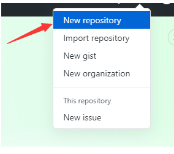
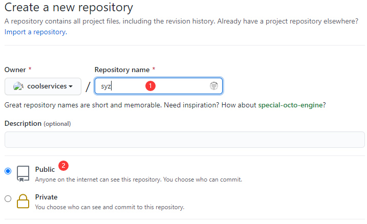
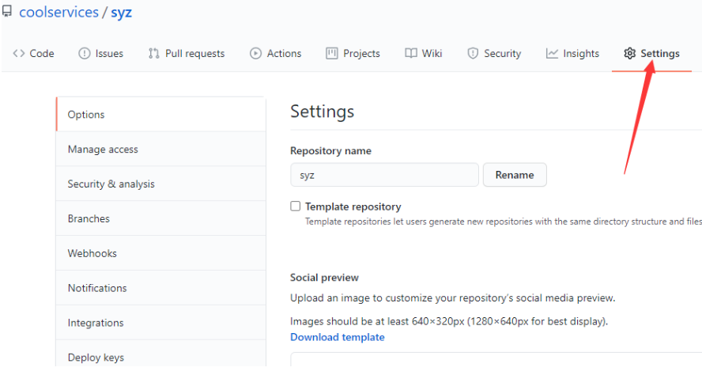
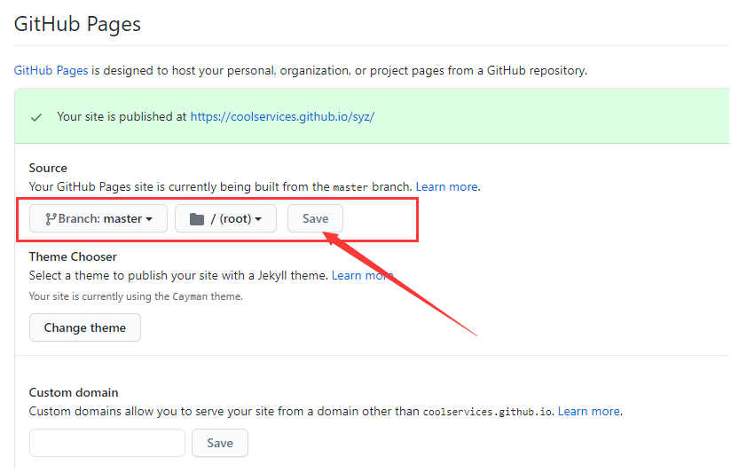

1，新建立仓库，如下图所示




2，对仓库取名，如下所示：



上传代码，命令如下：

```
echo "# syz" >> README.md
git init
git add README.md
git commit -m "first commit"
git branch -M main
git remote add origin https://github.com/coolservices/syz.git
git push -u origin main
                
```

推送到远程仓库命令如下

```
git remote add origin https://github.com/coolservices/syz.git
git branch -M main
git push -u origin main
```

4，点击设置，开启github pages




设置好后，点击保存：

